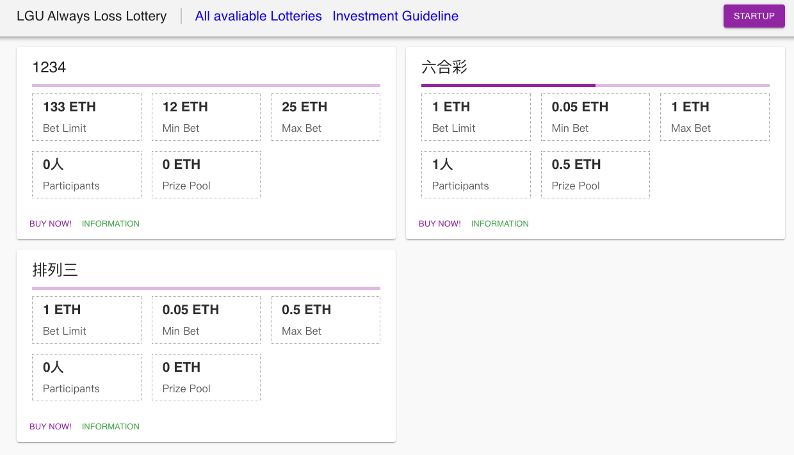

# LGU Always Loss Lottery

## What is it?

A naive implemented Ethereum smart contract based lottery DApp. Based on:
* [React](http://reactjs.org/) : Frontend and status managements.
* [Next.js](https://nextjs.org/): Handling backend requests.
* [Material UI](https://material-ui.com/): Appearance components. 

## Development Environments:

* Node.js (>=8.0)
* Web3.js (@1.0.0-beta34)
* Chrome with Metamask

## Deploy Dependencies:

* mocha (=5.2.0)
* pm2 (=2.10.4)

## Reference:

* [Material_UI sample](https://github.com/mui-org/material-ui/tree/master/examples)
* [ethereum-lottery by other developers](https://github.com/Evalll/ethereum-lottery)
* [A Juejin tutorial of developing DApp](https://juejin.im/book/5addb2eb6fb9a07abd0d4557)

## Frontend and Function Snips

* Homepage:

* StartUp an Lottery:

* Join a Lottery:

